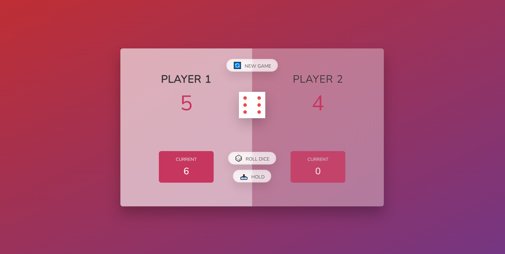

# jPig Game

Pig Game

## Beschreibung

- Das Spiel hat 2 Spieler, die abwechselnd spielen.
- In jeder Runde würfelt ein Spieler so oft er will. Jeder Wurf wird zu seiner aktuellen Punktzahl hinzugefügt.
- Aber wenn der Spieler eine 1 würfelt, verliert er seine aktuelle Punktzahl und es ist der nächste Spieler an der Reihe.
- Der Spieler kann wählen, seine Runde zu beenden, was bedeutet, dass seine aktuelle Punktzahl zu seiner Gesamtpunktzahl hinzugefügt wird. Danach ist es der nächste Spieler an der Reihe.
- Der erste Spieler, der 100 Punkte oder mehr erreicht, gewinnt das Spiel.

## Zusätzliche Funktionen

Das Spiel bietet auch eine Neustart-Funktion, mit der die Spieler das Spiel jederzeit zurücksetzen und von vorne beginnen können.

## Vorschau

 

## Verwendete Technologien

- HTML
- CSS
- JavaScript
